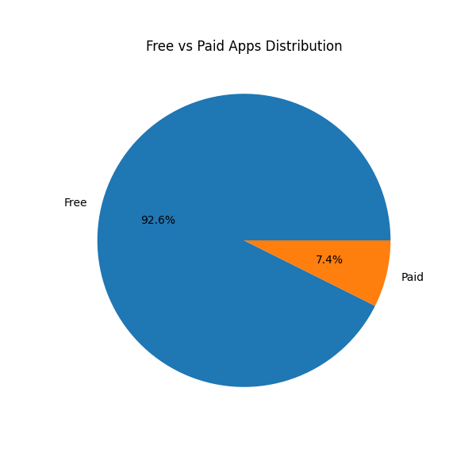
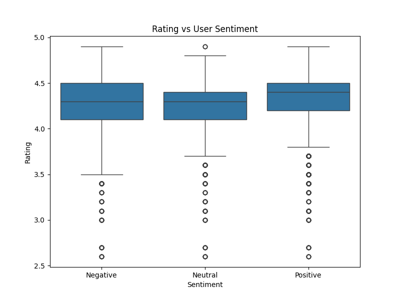
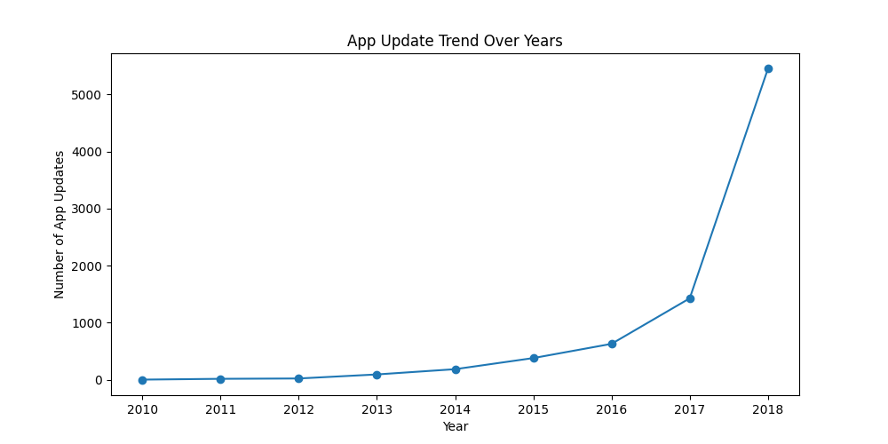

# Google Play Store App Data Analysis

## 📌 Project Overview
This project analyzes Google Play Store app data to understand app performance, user ratings, category trends, and the impact of user sentiment on app success.

## 🎯 Objectives
- Identify high-performing app categories
- Compare free vs paid apps
- Analyze user sentiment and its effect on ratings
- Discover key business insights using data

## 📂 Dataset
- apps.csv – App details (category, rating, installs, price, etc.)
- reviews.csv – User reviews and sentiment information

## 🛠 Tools & Technologies
- Python (pandas, numpy, matplotlib, seaborn)
- Excel (Pivot Tables, Conditional Formatting)

## 📊 Key Analysis Performed
- Data cleaning and preprocessing
- Exploratory Data Analysis (EDA)
- Category-wise rating and install analysis
- Sentiment analysis on user reviews
- Excel-based validation using pivot tables

## 📈 Visualizations
- Average Rating by App Category
- Free vs Paid Apps Distribution
- Rating vs User Sentiment
- App Update Trend Over Time

## 🧠 Business Insights
- Free apps receive significantly more installs than paid apps
- Apps rated above 4.2 show higher positive sentiment
- Game category has high competition but relatively lower ratings
- Negative sentiment strongly correlates with rating decline

## ✅ Conclusion
This analysis highlights how app category, pricing model, and user sentiment influence app performance on the Google Play Store.

---
## 📈 Sample Visualizations

### Average Rating by Category

### Free vs Paid Apps

### Rating vs User Sentiment

### App Update Trend

